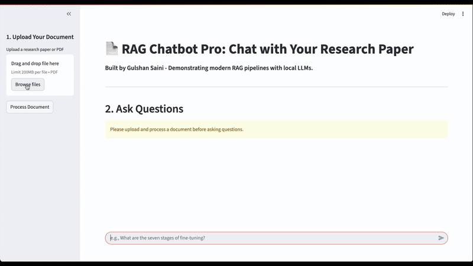

# 📄 RAG Chatbot Pro: AI-Powered Document Q&A

A sophisticated Question-Answering application that allows you to "chat" with your research papers. This project leverages a local, open-source Large Language Model (`Gemma3:4B`) and a state-of-the-art RAG (Retrieval-Augmented Generation) pipeline to provide accurate, context-aware answers from any PDF document.

---

### 🚀 Live Demo



---

### 💡 Core Features

*   **Interactive Chat Interface:** A user-friendly and professional web UI built with Streamlit.
*   **PDF Document Processing:** Upload any research paper or PDF and the system will ingest its contents.
*   **Advanced RAG Pipeline:** Utilizes a vector database (Qdrant) and a powerful retriever to find the most relevant information for any question.
*   **Local & Private:** Runs entirely on your local machine using Ollama, ensuring data privacy. No API keys needed.
*   **State-of-the-Art LLM:** Powered by Google's `Gemma3:4B` model for high-quality reasoning and answer generation.

---

### 🛠️ Tech Stack

*   **Language:** Python
*   **AI Framework:** LangChain
*   **LLM Provider:** Ollama (running `Gemma3:4B`)
*   **Vector Database:** Qdrant (in-memory)
*   **Embeddings Model:** `all-MiniLM-L6-v2`
*   **UI Framework:** Streamlit

---

### ⚙️ How It Works

The application follows a modern RAG pipeline:
1.  **Document Loading:** The user uploads a PDF, which is loaded and parsed by LangChain.
2.  **Text Splitting:** The document text is split into smaller, manageable chunks based on size and overlap.
3.  **Embedding & Indexing:** Each chunk is converted into a numerical vector (embedding) and stored in an in-memory Qdrant vector database for efficient searching.
4.  **Retrieval:** When a user asks a question, the retriever searches the vector database to find the top 5 most semantically similar chunks of text.
5.  **Generation:** The user's question and the retrieved text chunks are passed to the `Gemma3:4B` model with a specific prompt, which then generates a concise and contextually accurate answer.

---

### 📦 Installation & Setup

1.  **Clone the repository:**
    ```bash
    git clone https://github.com/gulshansainis/RAG-Chatbot-Pro.git
    cd RAG-Chatbot-Pro
    ```

2.  **Set up a Python virtual environment:**
    ```bash
    python -m venv venv
    source venv/bin/activate  # On Windows, use `.\venv\Scripts\activate`
    ```

3.  **Install the required dependencies:**
    ```bash
    pip install -r requirements.txt
    ```

4.  **Install and run Ollama:**
    *   Follow the instructions to download and install Ollama from [ollama.com](https://ollama.com/).
    *   Pull the required Gemma 3 model:
      ```bash
      ollama pull gemma3:4b
      ```

### ▶️ Usage

1.  **Ensure Ollama is running** in the background.

2.  **Run the Streamlit application:**
    ```bash
    streamlit run app.py
    ```

3.  Open your web browser to the local URL provided by Streamlit, upload a PDF, and start asking questions!